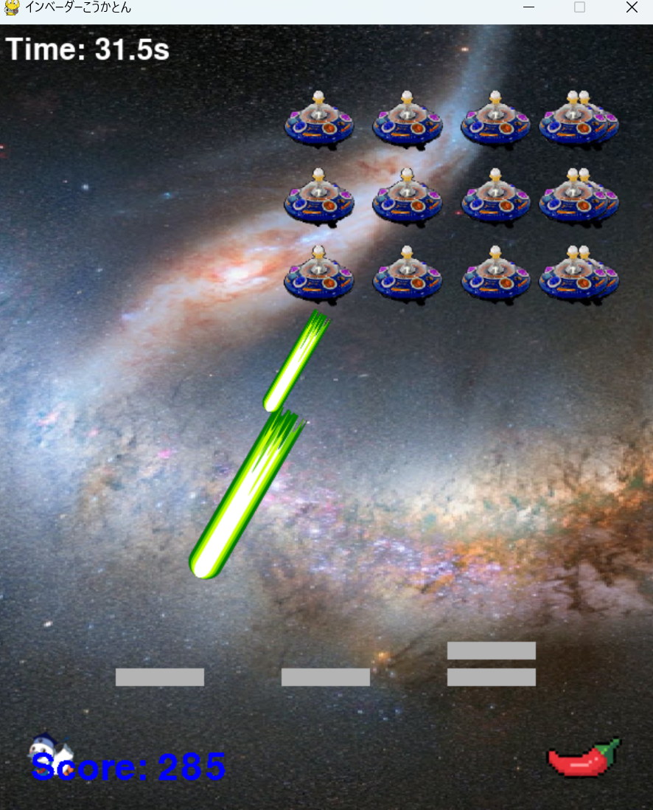

# インベーダーゲーム

## 実行環境の必要条件
* python >= 3.8
* pygame >= 2.1
* figフォルダ

## ゲームの概要
* 上にいる敵を撃ち落す
* こうかとんは横移動のみ、ビームはすべて上向き
* 敵をすべて撃破したら次のステージへ
* Game Overになるまで続く

## ゲームの遊び方
* 矢印キーでこうかとんを操作し，スペースキー押下によるビームで敵を倒す
* アイテムを拾うことで強化される
* こうかとんに敵の攻撃が当たったら，ゲームオーバーとなる

## ゲームの実装
* 敵を5*3の15体表示
* ビームが敵に当たったら敵を撃破
* とうがらしにこうかとんが触れるとビームが炎になる
* 敵の爆弾とビームが衝突したら両方削除
* 敵の爆弾がこうかとんに当たったらgame over
* 

### 共通基本機能
* 背景画像とこうかとんと敵の描画
* こうかとんの動きとビーム、爆弾の動き
* ゲームオーバー画面

### 分担追加機能
* アイテムエフェクト機能（担当:藤城）:アイテムを入手した時にアイテムに応じて処理を追加
* タイマー機能（担当：石崎）：時間表示
* 遮蔽機能（担当：石崎）：遮蔽の追加
* スコア表示機能（担当：初鹿）：スコアを表示
* 爆弾のデザイン変更機能（担当：初鹿）：爆弾デザインをただの色の円から画像へ変更
* ステージ追加機能（担当:高橋）：敵をすべて倒したときに次のステージへ移行
* モードセレクト機能の追加(担当:赤羽)：難易度を3種類用意して選択

### ToDo
* 音楽を付ける
* 壁が動く
* インベーダーを一列ずつ上下に動かす

### メモ
* ウインドウの幅は背景画像の大きさに設定してある。
* 難易度のレベルは大体2倍になるように設定。